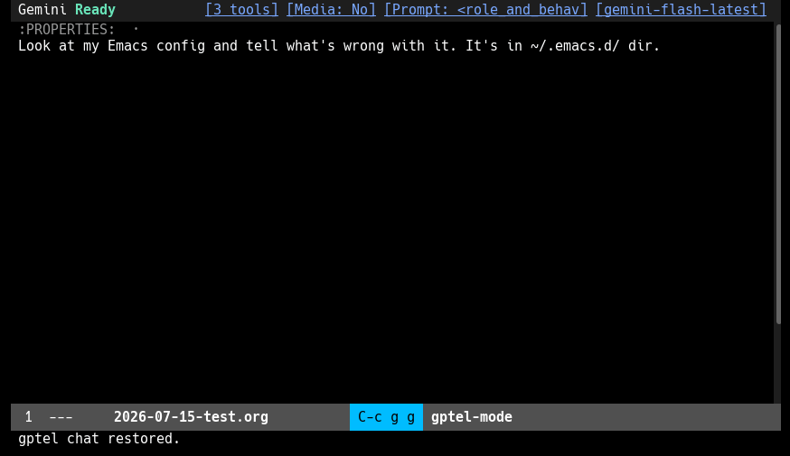

#+title: gptel-permit: Rule-Based Tool-Call Permissions for gptel

This package bridges the gap between granting an LLM full, unchecked freedom (losing all control) and being constantly interrupted to confirm or reject every minor tool call.

It adds a rule-based permission system (vaguely inspired by =iptables=) for [[https://github.com/karthink/gptel][gptel]] tool calls. You can define rules to automatically allow, deny, or require confirmation for tool calls based on the tool's name, group, or argument values (using regexps or predicates).

Whenever you're prompted to approve a tool call, =gptel-permit= gives you the option to create a rule on the fly based on your decision and conditions applied to the tool's arguments. The rule is then added to the session rules list and checked on every subsequent tool call, saving you time and attention.

DISCLAIMER: This is not a proper security measure for isolating or sansboxing an LLM. Its goal is to prevent the LLM from doing something stupid, not something malicious. If you need a hardened setup, don't rely on this package alone.

* A Use Case
Imagine you are working on a package located in =/home/user/src/package1=, and have created a notebook (.md or .org file) for the session in this folder. 

Since you're comfortable allowing LLMs to read files within the project directory, you have a global rule for that (see [[id:3b0f5096-9e6a-44fa-95c1-2a72f314d11f][Built-in Global Rules]]). Consequently, the first few tool calls reading from this folder are accepted automatically. 

But then the LLM decides to inspect the sources of another package at =/home/user/src/package2=, which is outside the current project directory. It calls a Glob tool. Since there's no decision for that in the rules list, =gptel= prompts you for a confirmation. You're okay with the LLM reading from the second project as well.

Without =gptel-permit=, you'd have to press =C-c C-c= for each request. Now, instead of =C-c C-c= you can press =C-c C-b= to open a menu and add a rule allowing read access to the =/home/user/src/package2= folder. From then on, every read request to this folder (not just Grep, but Read, Glob, and any other tool defined as =read= in =gptel-permit-tool-groups= option) will be automatically approved.

Then you decide that it's fine to allow reads from this folder for any future session. You do =M-x customize-option gptel-permit-global-rules= and add the new rule. From now on, any read tool called on this folder will no longer distract you with confirmation prompts.

Another day you bring in a tool which, for example, greps git logs in a folder. It's a read tool, so you do =M-x customize-option gptel-permit-tool-groups= and add a record about it. All your previously added rules which target =read= tools will apply to this new tool.

* Installation

#+begin_src elisp
(use-package gptel-permit
  :ensure t
  :after gptel
  :vc (:url "https://github.com/krvkir/gptel-permit" :rev :newest)
  ;; Enable global minor mode so that rules would work in every buffer.
  :config (gptel-permit-mode 1)
  :custom
  ;; Add your vaults or other folders with sensitive data.  Entries
  ;; starting with "./" are project-root relative; the default is
  ;; ("~/.ssh/" "~/.gnupg/" "./.git"), and setting this option replaces
  ;; it — so keep "./.git" if you want the git protection.
  (gptel-permit-protected-dirs '("~/.ssh/" "~/.gnupg/" "./.git")) 
  ;; This option must be set to 'auto, otherwise gptel will discard the rule engine's decisions.
  (gptel-confirm-tool-calls 'auto))
#+end_src

(Note: =gptel-permit= requires =gptel= (v0.9.9+) and Emacs 29.1+.)

* How It Works

When an LLM calls a tool, =gptel-permit= performs:
1. *Sanity checks* that the tool is known and its required arguments are present. Misconfigured calls are denied with a message, preventing sloppy LLMs (such as DeepSeek) from crashing mid-session.
2. *Permission rules evaluation* to save you from manually deciding on cases you already decided on.

Session-local rules (=gptel-permit-rules=) are checked first, followed by global rules (=gptel-permit-global-rules=). The first matching rule decides the outcome.

The actions are:
- ~allow~: Auto-executes the tool call with no prompt.
- ~deny~: Blocks the tool call and returns an error message to the LLM.
- ~ask~: Forces a manual confirmation prompt.

If no rules match, gptel falls back to the behavior configured for a tool which was called (the ones declared with =:confirm= key in =gptel-make-tool= calls in your tools package).

Enabling =gptel-permit-mode=:
1. Installs validation and permission checks on gptel's tool-execution hooks (specifically, on =gptel-pre-tool-call-functions=).
2. Binds =C-c C-b= in gptel's tool-call overlay keymap to =gptel-permit-add-rule=.

* Extending the Engine

The core module is complete on its own: rules, validation, path-traversal
checks, logging and fail-closed error handling need no optional module.
Add-ons (sandbox, LLM judge, analytics) integrate through documented
extension points — the core never names a module.

** Action registry

Rules' =:action= values dispatch through =gptel-permit-action-handlers=, a
public alist mapping action symbols to handler functions. A handler is
called as ~(ID TOOL-CALL)~ — the tool-call id and the enriched
tool call — and returns a verdict plist (~(:confirm nil)~, ~(:confirm t)~,
~(:block "reason")~, ~(:confirm nil :args NEW-ARGS)~) or nil (defer). The
built-in ~allow~/~deny~/~ask~ entries are registered like any other; the
sandbox module registers ~sandbox~ at load.

Registering a custom action:

#+begin_src elisp
(setf (alist-get 'my-action gptel-permit-action-handlers)
      (lambda (_id tool-call)
        (if (string-match-p "^my-tools" (plist-get tool-call :name))
            (list :confirm nil)               ; auto-approve
          (list :confirm t))))               ; otherwise ask
;; then: (:tool "Bash" :action my-action)
#+end_src

A matched action with /no/ registered handler fails closed (~(:confirm t)~),
so a missing module can never silently auto-run a tool.

** Engine hooks

Three abnormal hooks observe and shape each decision; every engine
callback receives the same leading arguments ~(ID TOOL-CALL)~:

- =gptel-permit-before-rule-match-functions= — run once per tool call
  after the =:tool-call= event and before rule matching. Modules use it
  for per-call state lifecycle (the judge clears its verdict state
  here). Errors propagate and fail the call closed.
- =gptel-permit-events-functions= — an observer tap for the engine's
  events: ~(ID TOOL-CALL TYPE PAYLOAD)~ with TYPE = =:tool-call=,
  =:rule-match=, =:verdict= or =:confirm=. The event type set is open:
  future engine versions may emit more types through the same hook.
  Observers run isolated; an erroring observer is logged and can never
  alter a verdict.
- =gptel-permit-veto-functions= — run after the verdict is computed,
  only when a rule matched, via =run-hook-with-args-until-success= as
  ~(ID TOOL-CALL VERDICT)~. A non-nil return makes the *engine* upgrade
  the verdict to ~(:confirm t)~, preserving any =:args= rewrite; veto
  functions can only tighten, never loosen. Errors fail the call closed.
  (Analytics audit sampling rides this hook.)

** Tool-call ids

Each processed tool call gets one tool-call id from
=gptel-permit--mint-tool-call-id=, a
string of the form =TIMESTAMP.PID.SERIAL= with millisecond precision
(e.g. =20261005T143022.123.4242.42=) — unique across sessions, across
concurrent Emacs processes, and across calls within a session, with no
coordination. All events of one call share the id. Logs written by older
versions carry integer ids; the statistics fold both.

** Rule Format
Rules are written as property lists:

#+begin_src elisp
(:tool "<tool-name>"        ;; Or :tool-group <group-symbol>
 :conditions ((<target> . <regexp-or-predicate>) ...)
 :action allow)             ;; Or deny, or ask
#+end_src

- =target= can be a specific argument name (e.g., ~:command~, ~:file_path~) or an argument group symbol (e.g., ~path~).
- If neither ~:tool~ nor ~:tool-group~ is specified, the rule applies to all tools.

*Examples:*

Allow the =Bash= tool to run safe OpenSpec commands:
#+begin_src elisp
(:tool "Bash"
 :conditions ((:command . "^openspec [^&|;]*$"))
 :action allow)
#+end_src

Deny read access to any path containing "secret":
#+begin_src elisp
(:tool-group read
 :conditions ((path . "secret"))
 :action deny)
#+end_src

** Tool and Argument Groups
Tools and arguments are categorized under =gptel-permit-tool-groups=. This lets you write high-level rules that apply to entire categories of tools. There are predefined groups for tools from [[https://github.com/karthink/gptel-agent][gptel-agent]], and you can add yours.

Arguments under the ~path~ group are automatically normalized with ~expand-file-name~ before matching.

** Built-in Predicates

Conditions can use built-in predicate keywords instead of regexps:
- ~:inside-project~: True if the path is within the current project or default directory.
- ~:outside-project~: True if the path is outside the current project.
- ~:inside-protected-dirs~: True if the path is within any directory listed in =gptel-permit-protected-dirs=.
- ~:path-traversal~: True if the unexpanded argument contains ~..~ or starts with ~/~ (absolute path).

** Built-in Global Rules
:PROPERTIES:
:ID:       3b0f5096-9e6a-44fa-95c1-2a72f314d11f
:END:

=gptel-permit-global-rules= provides safe out-of-the-box global defaults that are active in any session:

#+begin_src elisp
;; Allow read tools to access files inside the project
(:tool-group read
 :conditions ((path . :inside-project))
 :action allow)

;; Require confirmation for writes inside the project
;; (Personally, I set this to "allow" since it's relatively safe 
;; and covers most write calls.)
(:tool-group write
 :conditions ((path . :inside-project))
 :action ask)

;; Require confirmation for path-traversal or absolute writes
;; (That's for cases when your LLM tries to bypass restrictions
;; using "../" in filenames in tools where directory name and filename
;; are separate arguments.)
(:tool-group write
 :conditions ((path . :path-traversal))
 :action ask)

;; Auto-allow search tools (e.g. WebSearch, YouTube, most introspection commands)
(:tool-group search
 :action allow)

;; Require confirmation for accessing protected directories like ~/.ssh
;; or your personal knowledge base.
;; (See gptel-permit-protected-dirs option.)
(:conditions ((path . :inside-protected-dirs))
 :action ask)

;; Intercept potentially dangerous Bash commands
(:tool "Bash"
 :conditions ((:command . ".* rm .*"))
 :action ask)

;; Default fallback for any other tool call
(:action ask)
#+end_src

You can change them by customizing the =gptel-permit-global-rules= option.

** Rule Creation Menu

When gptel prompts you to approve a tool call, you can press =C-c C-b= (=gptel-permit-add-rule=) to create a rule on the fly:
1. *Group Detection*: If the tool or arguments belong to defined groups (e.g., the ~Read~ tool in the ~read~ group, or ~:file_path~ in the ~path~ group), you will be asked if you want to target the entire group.
2. *Condition & Action*: Prompt for the match condition (by choosing arguments or completing) and then select the action (~allow~, ~deny~, or ~ask~).

The rule is instantly added to your active session (=gptel-permit-rules=) and applied.

** Customization Options

- =gptel-permit-global-rules=: Persisted global rules.
- =gptel-permit-tool-groups=: Map tool names to tool-groups and argument-groups.
- =gptel-permit-protected-dirs=: Directories matching the ~:inside-protected-dirs~ predicate and read-only bound by the sandbox (default: ~("~/.ssh/" "~/.gnupg/" "./.git")~). An entry starting with =./= is resolved against the project root, so =./.git= protects the current project's git metadata (hooks and config).
- =gptel-permit-log-enabled=: Set to ~t~ to print verbose matching diagnostics to the =*gptel-permit-log*= buffer.

* Sandboxing Bash Commands
:PROPERTIES:
:ID:       7a2c1d84-0f6e-4a1b-9d3b-5e8f10a2b3c4
:END:

The ~sandbox~ rule action runs execute-group tool calls inside an OS-level
boundary instead of prompting you for every command. When a rule with
~:action sandbox~ matches, =gptel-permit= rewrites the tool call's =:command=
through a sandbox wrapper and returns ~(:confirm nil :args …)~ — gptel's
officially supported args-rewrite return. The wrapped command is visible in
the LLM message history and in the confirm UI. Rules, the judge, and
validation always evaluate the /original/ command; the wrapping happens last.

This is the only mechanism in this package that is an actual security
boundary: the model can operate unattended, and anything outside the
writable set fails with a deterministic OS error that is fed back to the
model. Commands needing boundary access (e.g. ~ssh~) should match an ~ask~
rule placed above the sandbox rule and run unsandboxed after your explicit
approval.

*DISCLAIMER:* the sandbox is a best-effort boundary, not a sandbox escape
guarantee. Read the "Known Limitations" below before running an agent
unattended.

** Backend selection

=gptel-permit-sandbox-backend= chooses the backend that builds the wrapper:

- ~auto~ (the default) :: a static platform table — =gnu/linux= → ~bwrap~,
  =darwin= and =windows-nt= → ~srt~, any other platform → nothing. The table
  is consulted on /every/ call (no memoization), so a binary installed
  mid-session is picked up without a restart. There is no cross-fallback:
  when the table-picked backend is unavailable the call fails closed to
  manual confirmation instead of quietly trying another backend. Set the
  option explicitly if you disagree with the table.
- ~bwrap~, ~srt~ :: the shipped backends, on any platform.
- any other symbol :: your own backend, registered in
  =gptel-permit-sandbox-backends= (see [[*Writing a backend][Writing a backend]]).

The shipped backends live in their own files
(=gptel-permit-sandbox-bwrap.el=, =gptel-permit-sandbox-srt.el=); the
sandbox core loads one lazily the first time it is needed, so requiring
them yourself is optional.

*Migration note:* the backend symbol ~builtin~ was renamed ~bwrap~. If you
set ~gptel-permit-sandbox-backend~ to ~'builtin~, change it to ~'bwrap~.
The sandbox action used by rules is still spelled ~sandbox~.

** Bubblewrap backend (=bwrap=)

Requires only =bubblewrap= (=bwrap=) on Linux. The wrapper is:

#+begin_example
bwrap --die-with-parent --new-session --clearenv --setenv V v ...
      --ro-bind / / --dev /dev --proc /proc --tmpfs /tmp [--unshare-net]
      --bind <writable-dir> <writable-dir> ...
      --ro-bind <protected-path> <protected-path> ...
      -- bash -c 'ORIGINAL COMMAND'
#+end_example

- The root is bound read-only, so reads match what in-process tools
  (=Read=, =Grep=) see; only writes outside writable dirs and network differ.
- Writable overlays come from =gptel-permit-sandbox-writable-dirs=
  (default: the project root).
- The environment is scrubbed (=--clearenv=) and rebuilt from
  =gptel-permit-sandbox-env-keep= (default: PATH, HOME, LANG, LC_ALL, TERM,
  TMPDIR).
- Network is off by default; set =gptel-permit-sandbox-network= to ~t~ to
  leave it on (binary on/off — the bwrap backend has no domain allowlist;
  that needs srt or a proxy).
- Read-only binds come from =gptel-permit-protected-dirs= plus existing
  shell rc files (=~/.bashrc=, =~/.bash_profile=, =~/.profile=, =~/.zshrc=).
  The option's default is ~("~/.ssh/" "~/.gnupg/" "./.git")~, where the
  =./= prefix means "relative to the project root"; the sandbox adds no
  hardcoded paths of its own, so re-add =./.git= if you customize the
  option.
- =gptel-permit-sandbox-extra-args= is an escape hatch for extra bwrap
  flags.
- Fail closed: if the backend's binary is not on =exec-path= (or the
  platform does not match), the action returns ~(:confirm t)~ (manual
  confirmation) instead of silently running anything.
- A tool without a registered sandbox adapter (see
  [[*Tool adapters][Tool adapters]]) fails closed the same way, with a message
  naming the tool — no guessing which argument to wrap.
- Retry latch (per gptel buffer): after
  =gptel-permit-sandbox-retry-limit= (default 3) consecutive sandboxed-command
  boundary failures, every sandbox verdict becomes a manual confirmation —
  and stays that way until a sandboxed command succeeds or you run
  =M-x gptel-permit-sandbox-reset=. The latch is deliberately sticky: you
  triage the cause once and clear it explicitly, instead of the streak
  silently resetting itself.

** Setup

#+begin_src elisp
(use-package gptel-permit
  :vc (:url "https://github.com/krvkir/gptel-permit" :rev :newest)
  :config
  (gptel-permit-mode 1))
#+end_src

=gptel-permit-sandbox.el= is part of the package and is loaded on demand;
you do not need to require it explicitly (the =sandbox= action fails closed
if it is missing). Enablement is opt-in via a rule:

#+begin_src elisp
;; Auto-run anything inside the sandbox:
(add-to-list 'gptel-permit-global-rules
             '(:tool-group execute :action sandbox))
#+end_src

Recommended order for global rules (first match wins):

1. Deny/ask rules for text you never want to run (e.g. =.* rm .*=).
2. An ask rule for boundary-crossing commands (see below).
3. ~(:tool-group execute :action sandbox)~.

Note: =Eval= calls match a blanket ~(:tool-group execute :action sandbox)~
rule but have no =:command= argument, so they fail closed to a manual
confirmation. The sandbox covers =Bash=-style subprocesses only; =Write= and
=Edit= happen inside Emacs and are outside this boundary.

** Escape hatch: ask rules above the sandbox rule

Commands that legitimately need to cross the boundary (network, system
dirs) should be confirmed by a human:

#+begin_src elisp
(:tool "Bash" :conditions ((:command . "^ssh ")) :action ask)
(:tool-group execute :action sandbox)
#+end_src

The =ask= rule matches first (rules are evaluated in order, on the original
command), so ~ssh ...~ runs unsandboxed only after your approval.

** Judge-gated sandbox

Combine the LLM judge condition with the sandbox action: judged SAFE calls
are auto-run inside the sandbox; everything else falls through to the
next rule (normally ask):

#+begin_src elisp
(use-package gptel-permit-judge
  :after gptel-permit)

(:tool-group execute
 :conditions ((:command . gptel-permit-judge-safe-p))
 :action sandbox)
#+end_src

** Sandbox-and-accept: =C-c C-s=

=C-c C-s= accepts the pending calls /with sandboxed arguments/ — the same
rewrite the ~sandbox~ action applies — without waiting for a rule to match.
Use it when a call already reached the prompt (an ~ask~ rule, a mixed pack
that a judge refused to resolve, a judge timeout) and you want it to run
inside the boundary anyway.

Acceptance is all-or-nothing: if any pending call has no adapter, or no
backend is available, /nothing/ is accepted and the message names the
offending tool. Plain =C-c C-c= still accepts unwrapped, and rejecting the
prompt is unchanged.

** Writing a backend

A backend is an EIEIO class derived from =gptel-permit-sandbox-backend-base=
implementing two generic functions, plus one registry entry:

#+begin_src elisp
(require 'gptel-permit-sandbox)

(defclass my-nsjail-backend (gptel-permit-sandbox-backend-base) ())

(cl-defmethod gptel-permit-sandbox-available-p ((_ my-nsjail-backend))
  "Non-nil when this backend can run here."
  (executable-find "nsjail"))

(cl-defmethod gptel-permit-sandbox-wrap
  ((_ my-nsjail-backend) command root)
  "Return the sandboxed invocation string for COMMAND (project ROOT)."
  (and command
       (format "nsjail --chroot / --cwd %s -- /bin/sh -c %s"
               (shell-quote-argument (or root default-directory))
               (shell-quote-argument command))))

(add-to-list 'gptel-permit-sandbox-backends
             '(nsjail . my-nsjail-backend))
;; then: (setq gptel-permit-sandbox-backend 'nsjail)
#+end_src

- The generic functions are the contract: =C-h f
  gptel-permit-sandbox-wrap= lists every implementation, and the shipped
  =gptel-permit-sandbox-bwrap.el= / =gptel-permit-sandbox-srt.el= are
  copy-paste templates for a whole backend (class, two methods, registry
  entry, and their options).
- *Security-relevant:* whatever =gptel-permit-sandbox-wrap= returns runs
  without further confirmation. A wrap method that forgets a part of the
  boundary, or splices the command in unquoted, is a missing (or bypassable)
  sandbox. Return ~nil~ when the invocation cannot be built — the action
  then fails closed to manual confirmation.
- The base class ends in =-base= because EIEIO binds a class's name as a
  variable holding the class symbol: a class named exactly
  =gptel-permit-sandbox-backend= would clobber that option and silently
  disable ~auto~.
- Your backend joins ~auto~ only by you setting the option explicitly; the
  platform table never picks third-party backends.

** Tool adapters

Backends build wrapper strings; /adapters/ decide which argument of which
tool gets wrapped. =gptel-permit-sandbox-adapters= maps a tool name to a
function called as ~(ARGS TOOL-CALL ROOT)~ returning a rewritten argument
plist (or ~nil~, which fails closed):

#+begin_src elisp
(setf (alist-get "Eval" gptel-permit-sandbox-adapters)
      (list :wrap-args
            (lambda (args _tool-call root)
              (when-let* ((expr (plist-get args :expression)))
                (plist-put (copy-sequence args) :expression
                           (my-sandboxed-emacs expr root))))))
#+end_src

Adapters rewrite arguments only — they SHALL NOT execute anything:
execution stays gptel's, after the rewrite. The shipped registry has a
single entry for =Bash= (wrapping =:command= through the resolved
backend), and a tool with no adapter fails closed — so dropping a new tool
into the ~execute~ group never silently extends the sandbox to it.

** srt backend (opt-in)

Set =gptel-permit-sandbox-backend= to ='srt= to run the Anthropic
sandbox-runtime CLI instead. gptel-permit maps its defcustoms to srt's
settings JSON (=filesystem.allowWrite=, =filesystem.denyRead=/
=filesystem.denyWrite=, =network.allowedDomains=) into
=/tmp/gptel-permit-srt-settings.json= and wraps commands as
=srt --settings FILE bash -c '…'=. With the default ~auto~, srt is what
macOS and Windows resolve to; on Linux it is your explicit opt-in.

Note: on Linux, srt still requires node, socat and ripgrep for its network
proxy layer (the unofficial PyPI =sandbox-runtime= port has the same
requirements), so it is not a lighter path than the =bwrap= backend. The
srt backend ships documented-but-untested.

** Known limitations

- The =bwrap= backend is Linux-only (bubblewrap does not exist on
  macOS/Windows); with the default ~auto~ those platforms resolve to =srt=
  for their Seatbelt isolation.
- Mandatory read-only binds cover only paths that exist at wrap time
  (bubblewrap limitation); a shell rc file created later is not protected.
- A protected path that is a symlink is bound at its /target/ (bubblewrap
  refuses to mount onto a symlink destination, which would otherwise abort
  the whole invocation): a stow- or chezmoi-managed =~/.zshrc= is
  protected, and writes through the link are refused like writes to the
  target.
- No syscall filtering (no seccomp), no per-domain network filtering in the
  =bwrap= backend (network is binary on/off).
- Sandbox covers :command-bearing (Bash-style) tools only — those with a
  registered adapter. =Write=, =Edit=, =Insert=, =Mkdir= and =Eval= run
  in-process and are not covered; the adapter registry is the extension
  point for wrapping more tools (see [[*Tool adapters][Tool adapters]]).
- Reads are unrestricted inside the sandbox; only writes outside writable
  dirs and network differ from the host.
- Boundary-error detection (for the retry latch) matches common OS error
  strings in tool results and is heuristic.

* LLM Judge (opt-in)

=gptel-permit-judge.el= adds an LLM-as-a-judge rule condition: a small
model classifies a grey-zone tool call (typically a =Bash= command) as
obviously safe or not. The judge is /deny-only/: a =SAFE= verdict makes
the enclosing rule match, everything else (including a failed or
unparseable judge) falls through to the next rule. See the
[[id:7a2c1d84-0f6e-4a1b-9d3b-5e8f10a2b3c4][Judge-gated sandbox]] example for the recommended
combination with the =sandbox= action.

#+begin_src elisp
(use-package gptel-permit-judge
  :after gptel-permit
  :custom
  (gptel-permit-judge-backend "Ollama")    ; nil disables the judge
  (gptel-permit-judge-model "qwen3:4b"))
#+end_src

Other options: =gptel-permit-judge-timeout= (seconds to wait, default
15), =gptel-permit-judge-policy= (extra prose appended to the judge's
fixed security preamble) and =gptel-permit-judge-history-entries=
(recent conversation entries to include in the judge prompt, default 0).

** Keeping the judge fast

Judge latency is dominated by model thinking: a model asked to "think"
before a one-line verdict wastes seconds on every judged call. When
=gptel-permit-judge-request-params= is nil (the default), the judge
derives thinking-off request parameters from the judge backend's type
and let-binds them as gptel's =gptel--request-params= around its
request, so they are merged into the request body:

#+begin_src elisp
;; Derived by default when gptel-permit-judge-request-params is nil:
;;   Anthropic: (:thinking (:type "disabled"))
;;   OpenAI:    (:reasoning_effort "minimal")
;;   Gemini:    (:generationConfig (:thinkingConfig (:thinkingBudget 0)))
;;   Ollama:    (:think :json-false) — (:think "low") for GPT-OSS models,
;;              which ignore booleans (their trace cannot be fully disabled)
;; Unrecognized backends (incl. OpenAI Responses): nothing injected.
#+end_src

On Ollama the derivation is model-sensitive: =think: false= is a
harmless no-op for models without a thinking capability (verified on
Ollama 0.32.14), but GPT-OSS models ignore booleans entirely and take
levels instead (=low=, =medium=, =high=; the trace cannot be fully
disabled), so the judge derives the smallest level for them.

To pin the judge request body yourself, set
=gptel-permit-judge-request-params= to a plist; a non-nil value always
wins over the derived default. Copy-paste starting points:

#+begin_src elisp
;; Anthropic judge: thinking off, deterministic sampling:
(setq gptel-permit-judge-request-params
      '(:thinking (:type "disabled") :temperature 0.0))
;; OpenAI (Completions API) judge: low reasoning effort:
(setq gptel-permit-judge-request-params '(:reasoning_effort "low"))
;; Gemini judge: small thinking budget instead of none:
(setq gptel-permit-judge-request-params
      '(:generationConfig (:thinkingConfig (:thinkingBudget 512))))
;; Ollama judge that keeps thinking on (slow, but thorough):
(setq gptel-permit-judge-request-params '(:think t))
;; Ollama judge with a minimal thinking budget (a level, not a boolean):
(setq gptel-permit-judge-request-params '(:think "low"))
#+end_src

Note: gptel's merge is shallow, so a =:generationConfig= here replaces
the one gptel builds itself (temperature, max tokens). Judge requests
are bare, so this clobbering is safe for them. An empty plist is
indistinguishable from nil in Emacs Lisp — there is no separate
"empty" state; to suppress the derived thinking-off params, set a
non-nil plist re-enabling what you want (e.g. =(:think t)= on Ollama).

If thinking-off parameters backfire — some models ignore them and
instead start writing their reasoning into the answer, or glue their
verdict onto a prose line — set =gptel-permit-judge-control-thinking=
to nil: no thinking-related parameters are derived or injected at
all, and the judge model runs with its default behavior (your own
=gptel-permit-judge-request-params=, if set, are still sent verbatim).

The judge request is also isolated from your session's persona: it
is sent with no system message at all. Without this, =gptel-request=
inherits the /buffer-local/ =gptel-system-prompt= of the calling gptel
buffer — persona, oracle instructions, response-formatting rules — and
prepends it to the judge prompt, where it fights the judge preamble
("answer with SAFE or UNSAFE on the first line") and sends small
models into out-loud deliberation about which instruction to obey.
The judge model sees only its own security preamble.

Some models keep deliberating regardless: Ollama =:cloud= models
(e.g. =glm-5.3-flash:cloud=) ignore =think: false= and interleave their
reasoning with the answer text — one was observed gluing a closing
think tag directly between its prose and the verdict, all on one
line. Verdict parsing tolerates this in two steps (see the next
section): a closing think tag cuts everything before it, and then
the divider applies; if no verdict line remains, the call
parse-fails and falls through to the next rule. If the derived
parameters make your judge /more/ verbose,
=gptel-permit-judge-control-thinking= nil turns the request-side
attempts off entirely.

** Judge failure classes and the log

Every judge outcome is distinguishable in the =*gptel-permit-log*=
buffer (enable it via =gptel-permit-log-enabled=):

- =Judge verdict: safe rationale: …= / =Judge verdict: unsafe rationale: …= ::
  an evaluated verdict; the rule matches only on =safe=.
- =Judge response unparseable: …= ::
  the backend responded, but no line of it was exactly =SAFE= or
  =UNSAFE= — often a thinking model that ignored the thinking-off
  request; the full raw response follows (untruncated, to aid
  debugging).
- =Judge request failed: …= ::
  the request itself failed: unknown backend name, HTTP error, or no
  response at all.
- =Judge timeout after Ns= ::
  =gptel-permit-judge-timeout= elapsed, or the wait was interrupted
  with =C-g=.

gptel may fire its request callback more than once: a model whose
reasoning is captured separately (e.g. an Ollama model with =think=
enabled) delivers a =(reasoning . …)= cons before the real answer. Both
judge modes wait through these intermediate deliveries — a thinking
judge therefore takes its full thinking time before the verdict lands,
and only a terminal delivery (a string, a failure, or an empty body)
ends the wait.

Older versions logged every failure as one opaque =Judge verdict: FAIL
rationale:= line with the raw response discarded. Now each judge run
records a verdict symbol in =gptel-permit--last-judge-verdict= — one of
=safe=, =unsafe=, =parse-fail=, =request-fail= or =timeout= (=nil=
when the judge did not run) — which the analytics =judge-verdict=
field carries verbatim, so a genuine =unsafe= is never confused with a
judge that broke. All failure classes remain deny-only: the enclosing
rule does not match and evaluation falls through.

Verdict parsing runs in two steps. First the closing-tag heuristic:
when the response contains a closing reasoning tag, everything up to
and including the last one is dropped — models that stream reasoning
and glue the closing tag onto the answer line still leave a
parseable verdict behind. Then the divider applies to what remains:
the first line whose entire (trimmed) text is exactly =SAFE= or
=UNSAFE= splits it — everything above is treated as leaked model
reasoning and dropped, everything below becomes the rationale.
Verdict words glued into the middle of a longer line (a server
concatenating thinking and answer text without a separator) do not
count. An exploratory =UNSAFE= draft followed by a =SAFE= conclusion
(or vice versa) — standalone verdict words appearing anywhere in the
remaining text — is treated as unparseable rather than guessed, and
an unparseable response is stored and logged in full; all of these
fall through to the next rule.

** The judge action (async by default)

Besides the condition form, the judge is also available as a rule
/action/:

#+begin_src elisp
;; Bare form: allow on SAFE, ask on UNSAFE.
(:tool "Bash" :conditions ((:command . "^make ")) :action judge)
;; One action: sandbox on SAFE, ask on UNSAFE.
(:tool "Bash" :conditions ((:command . "^make ")) :action (judge sandbox))
;; Two actions: sandbox on SAFE, deny on UNSAFE.
(:tool "Bash" :conditions ((:command . "^make ")) :action (judge sandbox deny))
#+end_src

=judge= is equivalent to =(judge allow ask)=; =(judge A)= to =(judge A
ask)=. Both slots accept =allow=, =deny=, =ask= and =sandbox=. The
judge inspects the call's full argument set. A malformed form warns
and behaves as =ask=.

Where the /condition/ form gates whether a rule matches (and falls
through to later rules when it doesn't), the /action/ form owns the
call once its conditions match — the judge's verdict picks the
resolution and no later rule is consulted:

| Judge outcome | Resolution |
|---------------+------------|
| SAFE          | the ON-SAFE action |
| UNSAFE        | the ON-UNSAFE action (=deny= blocks with the rationale in the reason) |
| failure (timeout, parse-fail, request-fail) | manual confirmation — never the ON-UNSAFE action |

With =gptel-permit-judge-async= non-nil (the default), Emacs never
blocks: the confirmation prompt appears immediately with a "⏳
judging…" indicator, the request runs in the background, and the
verdict is applied when it lands — a SAFE pack is accepted
programmatically, UNSAFE applies its action, and the indicator
vanishes. The wait is bounded by =gptel-permit-judge-timeout= (a
watchdog resolves the call as a timeout and leaves the prompt). If
you answer the prompt first, the stale verdict is discarded and
logged.

Two constraints keep async resolution conservative:

- *Pack uniformity*: gptel accepts or rejects a prompt pack as a
  whole, so a programmatic resolution happens only when /every/ call
  in the pack is judge-gated and their resolutions agree. A mixed
  pack (one judged call, one plain ask call) always waits for you.
- *Audit sampling*: when analytics sampling selects a judge-gated
  call, the judge still runs and its verdict is logged, but the
  resolution is forced to the manual prompt — a sampled call is never
  programmatically accepted or rejected. This measures the judge's
  false-SAFE and false-UNSAFE rates alike.

The prompt-while-judging flash is the accepted tradeoff of the async
mode. Set =gptel-permit-judge-async= to nil to go back to the
blocking behavior (the judge then freezes Emacs for up to
=gptel-permit-judge-timeout= seconds per judged call, exactly like
the condition form).

* Local Analytics (opt-in)

To know whether the permission layer is actually reducing prompt fatigue
without sacrificing safety, =gptel-permit-analytics.el= records the full
decision chain of tool calls in an append-only JSONL log. The data stays
on your machine and never leaves Emacs — hence "analytics", not telemetry.
The module is /inert/ until you explicitly register it; nothing is written,
no advice is installed and no sampling occurs before that.

** Events recorded

Each event is one JSON line in =gptel-permit-analytics-file= and carries an
tool-call id, a timestamp and a type. The id is a string minted by the
rule engine (see [[*Extending the Engine][Tool-call ids]]); all events of
one call share it, and log files written by older versions (integer ids)
still fold into the statistics:

- =tool-call=: the call itself (tool, buffer, backend, model, truncated
  arguments), written when the permission hook evaluates the call.
- =rule-match=: which rule matched and its action.
- =verdict=: the hook verdict, including the judge's model, verdict and
  rationale when the LLM judge was involved in the decision. The
  =judge-verdict= field is one of =safe=, =unsafe=, =parse-fail=,
  =request-fail= or =timeout= — the failure classes distinguish "the
  judge said no" from "the judge broke" (unparseable response, failed
  request, or timeout).
- =confirm=: a manual prompt was shown.
- =judge-verdict=: a judge action resolved the call — the verdict
  (including failure classes), rationale, judged arguments and judge
  latency in milliseconds, correlated with the call's id.
- =decision=: the resolution (allow / cancel / steer for user
  decisions, auto-allow / deny for programmatic judge resolutions)
  together with the milliseconds spent on the prompt. A cancel is
  recorded as an event, not a terminal outcome (gptel permits
  resuming canceled calls).
- =audit=: the call was an auto-allow that got audited by sampling (below).

** Enabling

#+begin_src elisp
(use-package gptel-permit
  :after gptel
  :config
  (gptel-permit-mode 1)
  (require 'gptel-permit-analytics)
  (gptel-permit-register-analytics-hooks))
#+end_src

=gptel-permit-register-analytics-hooks= (idempotent) installs
decision-capture advice on gptel's =gptel--accept-tool-calls=,
=gptel--reject-tool-calls= and =gptel--steer-tool-calls= — the only path
through which every confirmation UI variant funnels — and sets
=gptel-permit-analytics-enabled= to ~t~. =gptel-permit-unregister-analytics-hooks=
removes everything again. Setting the =gptel-permit-analytics-enabled=
option /alone/ does nothing: registration is the enablement.

** Audit sampling

While analytics is active, a configurable fraction
(=gptel-permit-analytics-sample-rate=, default 0.2) of auto-allowed calls —
rule ~allow~ or a successful ~sandbox~ — is randomly upgraded to a manual
prompt. Your decision on these sampled calls measures the /false-allow
rate/: a cancel or steer means the automation would have done something
you didn't want. Deny verdicts are never sampled (asking a human to
overrule a security veto trains the wrong reflex), and a sampled sandboxed
call still runs inside the sandbox once you confirm it. Each sampled call
is marked with an =audit= event.

** Reporting

Run =M-x gptel-permit-analytics-report= to render the statistics into the
=*gptel-permit-analytics*= buffer: totals (calls, auto-allowed, asked,
blocked, deferred), a per-tool breakdown (call counts, ask rate, average
wait time), daily/weekly/monthly breakdowns, and the false-allow audit
with its Wilson 95% confidence interval. For scripting, call the pure
=gptel-permit-analytics-compute= function, which returns the same
statistics as a plist without touching any buffer.

** Privacy notes

- The log file (=gptel-permit-analytics-file=, by default
  =~/.emacs.d/gptel-permit-analytics.jsonl=) is created with =0600=
  permissions.
- Argument values are truncated (first and last 30 characters).
- The file still contains tool names, commands and paths that ran on your
  machine plus your decisions — keep it local, and delete it when you are
  done measuring. Nothing is exported anywhere.

** Caveat: advice on gptel internals

Decision capture advises three gptel *internal* commands
(=gptel--accept-tool-calls=, =gptel--reject-tool-calls=,
=gptel--steer-tool-calls=). If gptel upstream changes them,
=gptel-permit-analytics= must follow. The advice is fully gated: absent
until registration, purely additive, and completely removed by
=gptel-permit-unregister-analytics-hooks=. Analytics failures are logged
and can never alter a permission verdict.
